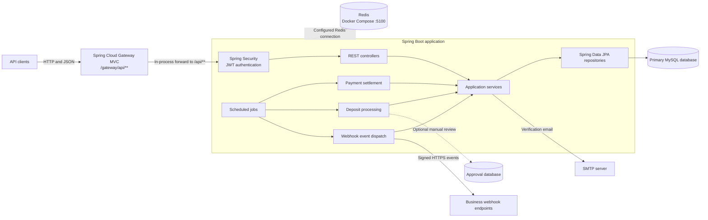

# Distributed Payment Gateway

A Spring Boot REST API for customer and business accounts with internal wallets, idempotent transfers, scheduled payment settlement, and signed webhooks. Payments move funds between wallet records in this application; this project does not connect to a card network, bank, or external payment provider.

## Features

- Customer registration with email verification and JWT-based sign-in.
- Spring Cloud Gateway MVC ingress routing from `/gateway/api/**` to the API handlers.
- Customer and business accounts, each with a wallet.
- Customer-to-business payments, customer-to-customer transfers, and business refunds.
- Idempotency keys for balance-changing requests, so safe retries do not apply the same operation twice.
- Scheduled payment settlement and admin-initiated deposits.
- Signed payment webhooks using HMAC-SHA256, with retries for failed deliveries.
- Currency changes when a wallet has no balance or pending payments.

## Technology

- Java 21 and Spring Boot
- Spring Cloud Gateway Server MVC, Spring Web MVC, Spring Security, Spring Data JPA, Spring Data Redis, and Spring Mail
- MySQL
- Redis (Docker Compose)
- Maven Wrapper
- JUnit and H2 for tests

## Architecture



Spring Cloud Gateway MVC provides the `/gateway/api/**` ingress and forwards requests in-process to the existing `/api/**` controllers; the original `/api/**` paths remain available for compatibility. The primary database stores customer and business accounts, wallets, payments, idempotency records, and webhook events. Scheduled jobs settle pending payments, process queued deposits, and dispatch webhook events. Deposits above the configured threshold use the optional approval database for manual review. Redis is provisioned and configured for connections on port `5100`; current business flows do not depend on it.

## Prerequisites

- JDK 21
- MySQL for running the application
- Docker Compose for the Redis service started with the application
- SMTP credentials for registration and email verification

## Configuration

The application reads configuration from `application.properties` and the following environment variables:

| Variable | Purpose |
| --- | --- |
| `DATASOURCE_URL` | Main MySQL JDBC URL, for example `jdbc:mysql://localhost:3306/distributed_payment_gateway` |
| `DATASOURCE_USERNAME` | Main database username |
| `DATASOURCE_PASSWORD` | Main database password |
| `JWT_SECRET` | Base64-encoded signing key; generate one with `openssl rand -base64 32` |
| `APPROVAL_DATASOURCE_URL` | Optional JDBC URL for the separate manual-deposit approval store |
| `APPROVAL_DATASOURCE_USERNAME` | Optional approval database username |
| `APPROVAL_DATASOURCE_PASSWORD` | Optional approval database password |

Configure SMTP with Spring Mail settings (`SPRING_MAIL_HOST`, `SPRING_MAIL_PORT`, `SPRING_MAIL_USERNAME`, and `SPRING_MAIL_PASSWORD`). Email verification requires a working SMTP configuration.

The application has `spring.jpa.hibernate.ddl-auto=none`; create the application database schema before starting it. The optional approval datasource is used for deposits over 1,000.00, which are queued for manual review. Without that datasource, requests above the threshold are rejected.

On application startup, Spring Boot Docker Compose starts the Redis service defined in [`compose.yaml`](compose.yaml), mapped to `localhost:5100`. Docker Compose must be installed and Docker running. The app connects to Redis at that address; Spring Boot stops the service when the app shuts down.

## Run locally

The API starts on port `8080` by default. SMTP settings must also be configured to use registration and email verification.

## Run tests

Tests use an in-memory H2 database and a test-only JWT key, so they do not require MySQL, Docker, or external credentials:

```sh
./mvnw --batch-mode test
```

Build the application with:

```sh
./mvnw --batch-mode package
```

## API overview

The gateway routes API requests under `/gateway/api/**` to the corresponding `/api/**` endpoint (for example, `POST /gateway/api/auth/login` routes to `POST /api/auth/login`). The original `/api/**` paths remain available. Protected endpoints expect a JWT in the `Authorization: Bearer <token>` header. Register and verify a customer before logging in:

```sh
curl -X POST http://localhost:8080/gateway/api/auth/customer/register \
  -H 'Content-Type: application/json' \
  -d '{"firstName":"Ada","lastName":"Lovelace","email":"ada@example.com","phoneNumber":"+1 555 123 4567","password":"StrongPassword1!"}'
```

The verification code is sent to the registered email address. After verification, log in at `POST /api/auth/login`; the response contains a JWT. Use that token with authenticated routes.

| Area | Example routes | Purpose |
| --- | --- | --- |
| Authentication | `POST /api/auth/customer/register`, `POST /api/auth/verify-email`, `POST /api/auth/login` | Account creation, verification, and sign-in |
| Customer | `GET /api/customer/`, `GET /api/customer/wallet`, `PUT /api/customer/pay` | Customer profile, wallet, and business payment |
| Wallet | `GET /api/wallet`, `POST /api/wallet/transfer`, `PATCH /api/wallet/currency` | View and manage a customer wallet |
| Business | `GET /api/business/`, `POST /api/business/refund`, `POST /api/business/webhook` | Business profile, refunds, and webhook registration |
| Admin | `PUT /api/wallet/deposit` | Queue a trusted deposit; admin access required |

Balance-changing operations require an `Idempotency-Key` header. Reuse a key only when retrying the same request. Payments are initially pending and settle on the scheduled daily run. Deposits are also scheduled; the deposit endpoint is not a customer self-service top-up or a payment-provider integration.

See the [API guide](src/API.md) for request bodies, constraints, and detailed endpoint behavior.
